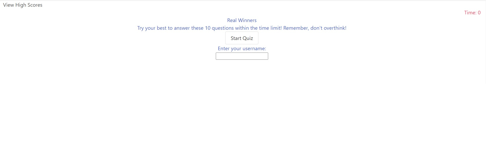

# Real Winners Quiz

## Key Concept

As a student, I often find myself frustrated with the current educational system that focuses more on earning points rather than ensuring I grasp the underlying concepts. This approach often leaves me memorizing information temporarily rather than truly understanding and retaining knowledge in the long term. To address this issue we are creating a test that tackles the ability of someone mastering a concept over relying on a pass/fail system. The test should be designed to evaluate the depth of knowledge and application of concepts, ensuring that students truly grasp the subject matter. It can consist of a combination of multiple-choice questions and true/false questions allowing students to demonstrate their comprehension and problem-solving skills.

## Challenges

The main obstacles we faced when it came to this project was in adopting and mastering a new css library that we have not used before. Probably the biggest challenge thus far, the API's. Finding and gaining access to the API's proved to be the most troublesome and it did not help that we initially wanted to use four API's. The biggest problem was to actually gain access to YouTube's API and with GitHub's API. With GitHub, the local key used to access the API keeps on getting revoked due to security measures and we have yet to learn how to use node.js.

## Contributions

We are thankful for having such a creative and hardworking team to bring this idea into reality.

Matthew Otabor, killing it with the html structure, functionality and Q & A's

Chrisly St Leger, creating something out of nothing with the css library Bulma, that was just introduced days ago

Cody Deering, bringing in one of the main API's with the code to impliment it

Kenneth Lau, working on our extra API and providing javascript code to impliment some extra fetures and functionality

Donald Leon, creating majority of the javascript code while providing our biggest key API and assisting the team with road blocks encountered

## Requirments

Use a CSS framework other than Bootstrap.

Be deployed to GitHub Pages.

Be interactive (i.e: accept and respond to user input).

Use at least two server-side APIs.

Does not use alerts, confirms, or prompts (use modals).

Use client-side storage to store persistent data.

Be responsive.

Have a polished UI.

Have a clean repository that meets quality coding standards (file structure, naming conventions, follows best practices for class/id-naming conventions, indentation, quality comments, etc.).

Have a quality README (with unique name, description, technologies used, screenshot, and link to deployed application).

## Presentation

Elevator pitch: A one-minute description of your application.

Concept: What is your user story? What was your motivation for development?

Process: What were the technologies used? How were tasks and roles broken down and assigned? What challenges did you encounter? What were your successes?

Demo: Show your stuff!

Directions for future development.

Links to the deployed application and the GitHub repository.

## Grading Rubric

### Technical Acceptance Criteria: 25%

Satisfies the following code requirements:

Application uses at least two server-side APIs.

Application uses client-side storage to store persistent data.

Application doesn't use JS alerts, prompts, or confirms (uses modals instead).

Application uses a CSS framework other than Bootstrap.

Application is interactive (accepts and responds to user input).

### Concept 10%

Application should be a unique and novel idea.

Your group should clearly and concisely articulate your project idea.

### Deployment: 20%

Application deployed at live URL and loads with no errors.

Application GitHub URL submitted.

Portfolio at live URL submitted, featuring project.

### Repository Quality: 10%

Repository has a unique name.

Repository follows best practices for file structure and naming conventions.

Repository follows best practices for class/id-naming conventions, indentation, quality comments, etc.

Repository contains multiple descriptive commit messages.

Repository contains a quality README file with description, screenshot, and link to deployed application.

### Application Quality: 15%

Application user experience is intuitive and easy to navigate.

Application user interface style is clean and polished.

Application is responsive.

### Presentation 10%

Your group should present using Powerpoint or a similar presentation software.

Every group member should speak during the presentation.

Your presentation should follow the Project Presentation Template.

### Collaboration 10%

There are no major disparities in the number of GitHub contributions between group members.

## GitHub Repo

[GitHub](https://github.com/BaBread/RealWinners)

## Deployed App

[Application](https://babread.github.io/RealWinners/)

